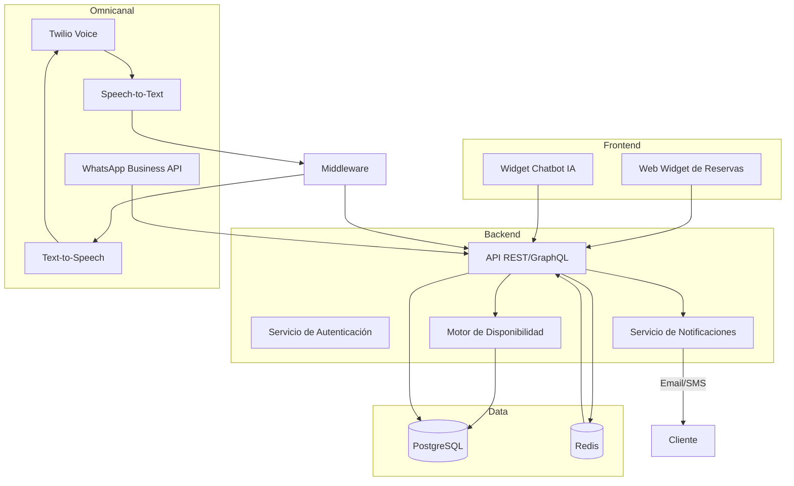

# Sistema Integral de Reservas Inteligentes para David Martin Barber Shop

## Resumen Ejecutivo
Este documento describe una propuesta técnica para la implementación de un sistema integral de reservas inteligentes que cubre dos fases principales: (1) un sistema de reservas con chatbot basado en IA integrado en la web existente y (2) automatización de citas mediante WhatsApp y llamadas telefónicas. La solución está diseñada para integrarse con https://davidmartinbarbershop.es/cortes-y-estilismo y ofrecer gestión de citas en tiempo real, respuestas automáticas y herramientas de fidelización mediante reseñas en Google.

## Objetivos Estratégicos
- **Reservas omnicanal**: Permitir que los clientes reserven desde la web, el chat del sitio o canales de mensajería/voz en la fase 2.
- **Disponibilidad en tiempo real**: Sincronizar las reservas con una base de datos central y reglas de negocio configurables.
- **Atención automática**: Incorporar IA conversacional capaz de resolver dudas sobre servicios, precios y horarios.
- **Fidelización**: Integrar un flujo para que los clientes puedan dejar reseñas en Google directamente desde el mapa embebido.

## Alcance
### Fase 1 – Sistema de Reservas + Chatbot IA
1. **Modelado de datos**
   - Entidades: Servicios, Profesionales, Horarios laborales, Bloques de tiempo, Reservas, Clientes.
   - Uso de una base de datos relacional (PostgreSQL) con soporte de transacciones para evitar overbooking.

2. **Backend API**
   - Framework sugerido: **NestJS** (Node.js) o **Django Rest Framework** (Python). En ambos casos se obtienen controladores REST/GraphQL y capacidad para integrar sockets en tiempo real.
   - Endpoints:
     - `GET /services`: lista de servicios con precios y duración.
     - `GET /availability`: devuelve disponibilidad filtrada por servicio/profesional/fecha.
     - `POST /bookings`: crea una reserva, enviando confirmación automática (correo/SMS).
     - `PATCH /bookings/:id`: gestión de reprogramaciones/cancelaciones.
     - `GET /bookings/:id`: consulta de detalles para el cliente.
   - Integración con proveedores de email/SMS (SendGrid, Twilio SendGrid, etc.) para notificaciones.

3. **Base de Datos**
   - Migraciones para crear tablas.
   - Jobs periódicos que bloqueen franjas en función de feriados o mantenimiento.
   - Auditoría básica (timestamps, estado de la cita).

4. **Frontend Web**
   - Integración en la página existente mediante un widget embebido (React/iframe) o modal emergente.
   - Componentes principales: Selector de servicios, calendario interactivo, formulario de datos del cliente, resumen y confirmación.
   - Conexión con la API para disponibilidad en tiempo real usando WebSockets o polling con revalidación.

5. **Chatbot IA en la Web**
   - Motor sugerido: **OpenAI Assistants API** o **Azure OpenAI**, con modelo en español especializado.
   - Entrenamiento con datos de servicios (precios, duración, restricciones) y FAQs personalizadas.
   - Integración mediante un widget flotante. Flujo conversacional:
     1. Saludo y oferta de ayuda.
     2. Detección de intención: consulta informativa, disponibilidad o reserva.
     3. Para reservas: recopilar servicio, fecha y hora; verificar disponibilidad vía API; crear reserva; enviar confirmación.
   - Uso de `function calling`/acciones para conectarse a la API de reservas.

6. **Botón de reseñas en Google Maps**
   - Inserción en el widget del mapa existente utilizando la URL directa de reseñas de Google My Business.
   - UI: botón "Deja tu reseña" que abra el enlace en una nueva ventana.

7. **Seguridad y Cumplimiento**
   - Autenticación basada en tokens para el panel administrativo.
   - Cifrado TLS (https) y cumplimiento con RGPD (consentimiento para almacenar datos personales).
   - Logs y monitorización (Grafana/Prometheus o servicios gestionados).

8. **Pruebas y Entrega**
   - Pruebas unitarias del backend (Jest/Pytest) y pruebas end-to-end del flujo de reserva.
   - Manual de administración con instrucciones de uso.
   - Entorno de staging antes de ir a producción.

### Fase 2 – Robot de Voz y WhatsApp
1. **Integraciones de Canal**
   - **WhatsApp Business API** (a través de Meta o proveedores oficiales como Twilio) para mensajes bidireccionales.
   - **Twilio Programmable Voice** para llamadas automatizadas.

2. **Motor Conversacional Multicanal**
   - Arquitectura de middleware que reutiliza la lógica conversacional del chatbot web.
   - Conversión voz-texto: Google Cloud Speech-to-Text o Amazon Transcribe.
   - Conversión texto-voz: Amazon Polly, Google Cloud Text-to-Speech o Twilio Voice.

3. **Gestión de Flujos**
   - Diagrama de estados con detección de intención, confirmación de datos y validaciones.
   - Escalado a operador humano en caso de dudas complejas.

4. **Sincronización de Reservas**
   - Uso de la misma API/backoffice para mantener coherencia.
   - Webhooks para actualizar el estado de citas y enviar recordatorios.

5. **Pruebas de Campo**
   - Scripts de prueba en entorno controlado.
   - Ajustes según feedback real.

## Arquitectura Propuesta

## Plan de Implementación
1. **Semana 1-2**: Análisis detallado, definición de requisitos y diseño UI/UX.
2. **Semana 3-4**: Desarrollo de backend (API, base de datos, lógica de disponibilidad).
3. **Semana 5-6**: Desarrollo del widget de reservas y chatbot IA web. Integración con API.
4. **Semana 7**: Integración de reseñas, pruebas funcionales y de carga, documentación.
5. **Semana 8**: Despliegue fase 1, formación del equipo.
6. **Semana 9-12**: Desarrollo robot de voz/WhatsApp, pruebas de campo y ajustes.

## Requisitos Técnicos y Herramientas
- **Backend**: Node.js 20 / Python 3.11, NestJS o Django, PostgreSQL 15, Redis 7.
- **Frontend**: React 18, TailwindCSS para estilos, integración mediante iframe/widget.
- **Infraestructura**: Docker + Docker Compose, despliegue en AWS (ECS/Fargate) o DigitalOcean App Platform.
- **IA**: OpenAI Assistants API (gpt-4o-mini o similar) con almacenamiento de contexto en base de datos.
- **Observabilidad**: Sentry para monitoreo de errores, Grafana para métricas.

## Recomendaciones Adicionales
- Preparar un panel administrativo para gestionar servicios, horarios y reservas manuales.
- Implementar tokens de autenticación temporales para clientes que consultan sus citas.
- Añadir recordatorios automáticos (24h y 2h antes de la cita) vía WhatsApp/SMS/Email.
- Mantener scripts de migración y seed para entornos nuevos.
- Documentar el API con OpenAPI/Swagger y generar SDKs ligeros para integraciones futuras.

## Próximos Pasos
1. Validar este diseño con stakeholders.
2. Definir presupuesto y proveedores (Twilio, hosting, licencias).
3. Establecer acuerdos de nivel de servicio (SLA) y políticas de soporte.
4. Iniciar la fase de análisis detallado y recopilar datos reales de servicios y disponibilidad.

